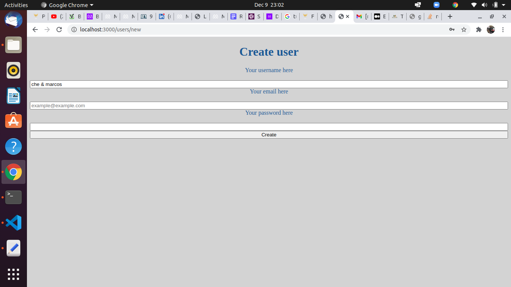

# Bare Metal Forms and Helpers

> This project aims at building  a basic form using ruby on rails framework. The basic operations that can be performed by a user is creating and editing his/her information.

## Getting started

You'll need to have both Ruby and Rails installed on your computer.

- In the desired directory, type `git clone git@github.com:marcoshdezcam/Rails_Forms.git` in the terminal.

- Then type `cd Rails_Forms` in the terminal to change the directory into the root of the project.

- Then type `bundle install && yarn install` to download the necessary gem files for the project.

- Run `rails server` to start the server for the application.

- Open `localhost:3000/users/new` to start filling in the form and create a new user.

- Open `localhost:3000/users/id/edit` to update an existing users' information. Remember to replace the `id` in the url with user id number such as `localhost:3000/users/2/edit`.

## 🔧 Built With

- Ruby on Rails
- GitFlow 
- Sqlite3
- Rubocop

## ✒️ Authors

👤 **Marcos Hernández Campos**

- Github: [@marcoshdezcam](https://github.com/marcoshdezcam)
- Twitter: [@MarcosHCampos](https://twitter.com/MarcosHCampos)
- Linkedin: [Marcos Hernández](https://linkedin.com/marcos-hernández-56058119a/)

**Che Blanchard**

- GitHub: [@che30](https://github.com/che30)
- Twitter: [@BlanchardNsoh](https://twitter.com/che55085128 )
- LinkedIn: [Che Blanchard](https://www.linkedin.com/in/che-nsoh-9455271b0/) 

## 🤝 Contributing

Contributions, issues and feature requests are welcome!

Feel free to check the [issues page](issues/).

## Show your support

Give a ⭐️ if you like this project!

## Acknowledgments

- Hat tip to anyone whose code was used
- Inspiration
- etc

## 📝 License

This project is [MIT](lic.url) licensed.